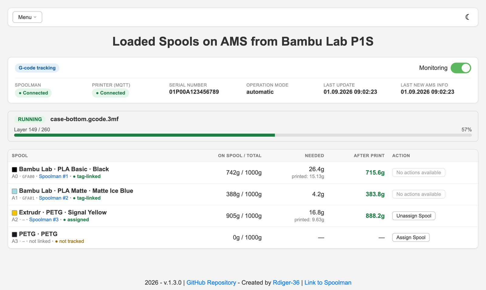
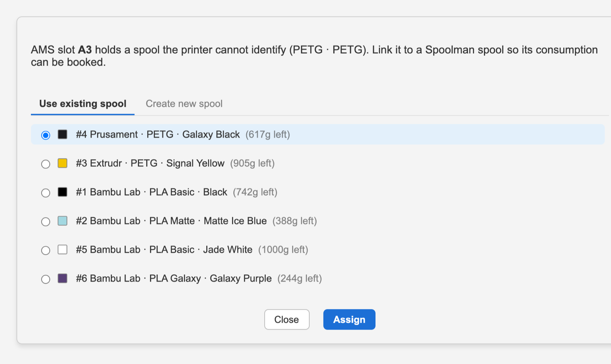
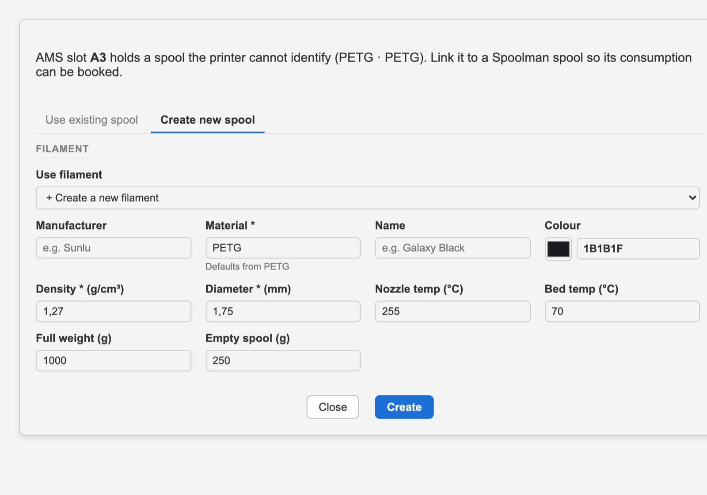
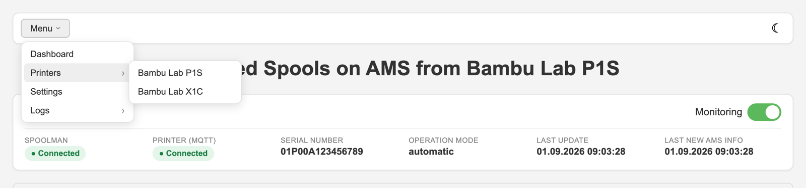
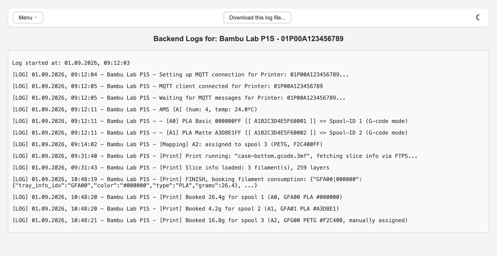
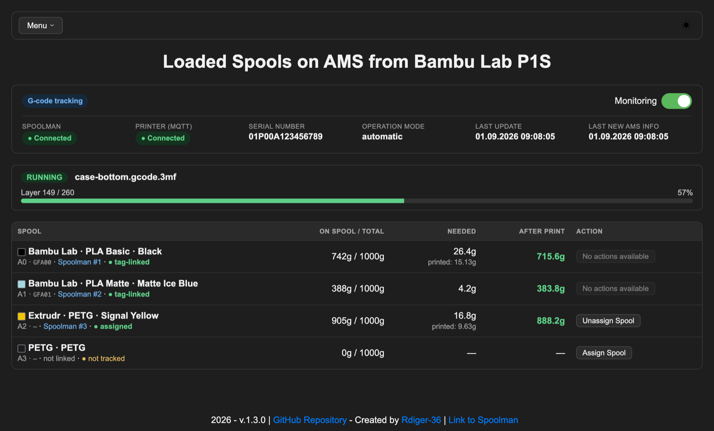
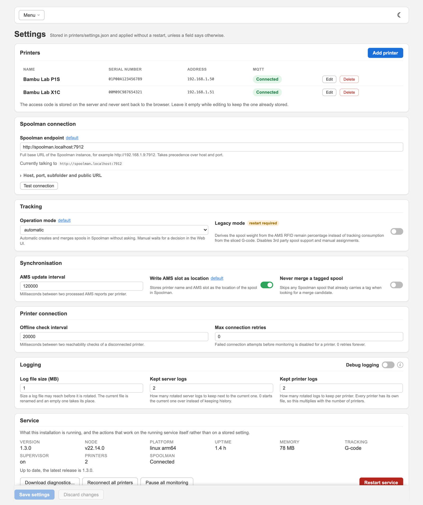
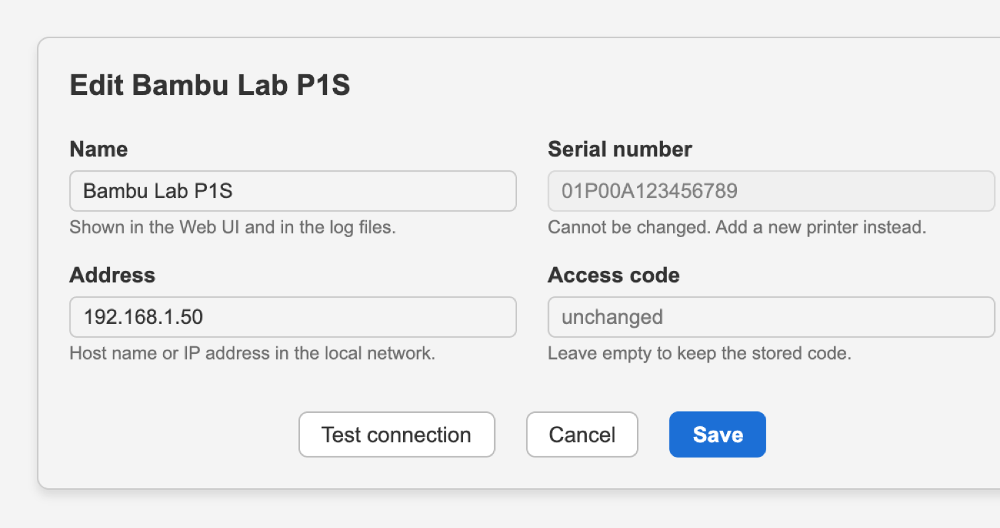
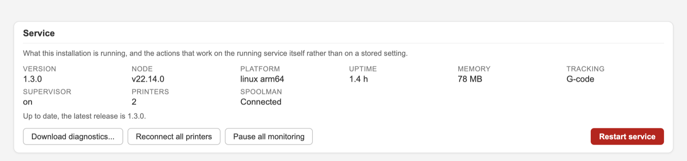

<h1 align="center">Bambulab AMS Spoolman Filament Status</h1>

<p align="center">
  Synchronize your Bambu Lab AMS filament spools with Spoolman, automatically.<br/>
  Tracks what a print actually consumes and keeps Spoolman in sync in real time.
</p>

<p align="center">
  
  
  
  
  
  
</p>

<p align="center">
  
  
  
  
  
</p>

---

Based on the idea of a script from [Diogo Resende](https://github.com/dresende), posted in this [issue](https://github.com/Donkie/Spoolman/issues/217).

## What changed in 1.3.0

- **G-code tracking is the new default.** Filament consumption is read from the sliced file of the print instead of the AMS RFID remain percentage, so 3rd party spools without a tag are covered as well. The previous behaviour lives on as [Legacy mode](#legacy-mode).
- **Everything is configured in the Web UI now.** The [settings page](#settings) holds every setting and the printer list.
- **Environment variables and hand-written `printers.json` are deprecated.** They keep working, see [Deprecated configuration](#deprecated-configuration).

## Attention

Works with Bambu Lab printers with a connected AMS of the A, P, H and X series.

Automatic creating and merging of spools and filaments in Spoolman relies on the RFID tag of original Bambu Lab spools. A 3rd party spool is linked to a Spoolman spool manually in the Web UI instead; its consumption is then tracked like any other.

### Supported hardware

| Printer | Supported |
| :---- | :---- |
| A series with AMS Lite | ⚠️ read only in [legacy mode](#legacy-mode) |
| A1 with AMS Standard / 2 Pro | ✅ |
| P series | ✅ |
| H series | ✅ |
| X series | ✅ |

| AMS | Supported |
| :---- | :---- |
| AMS | ✅ |
| AMS 2 Pro | ✅ |
| AMS HT | ✅ |
| AMS Lite | ⚠️ read only in [legacy mode](#legacy-mode) |

Up to 12 AMS on one printer: max. 4 AMS Standard / 2 Pro plus 8 AMS HT.

### Supported architectures

Pulling `ghcr.io/rdiger-36/bambulab-ams-spoolman-filamentstatus:latest` retrieves the right image for your machine.

| Docker platform | Also known as | Supported | Typical hardware |
| :---- | :---- | :----: | :---- |
| `linux/amd64` | x86-64, x64 | ✅ | PCs, servers, most NAS boxes |
| `linux/arm64` | aarch64, arm64v8 | ✅ | Raspberry Pi 3 and newer on a 64 bit OS, Apple Silicon |
| `linux/arm/v7` | armhf (Debian, Raspberry Pi OS), armv7 (Alpine) | ✅ | Raspberry Pi 2 and newer on a 32 bit OS, older ARM SBCs and NAS boxes |
| `linux/arm/v6` | armhf (Alpine), armel | ❌ | Raspberry Pi 1, Pi Zero, Pi Zero W |

"armhf" means two different things: Debian and Raspberry Pi OS use it for 32 bit ARMv7, which is supported, Alpine uses it for ARMv6, which is not. The Docker platform in the first column is the unambiguous identifier. A `no matching manifest for linux/arm/v6` on `docker pull` means the device is from the last row; those are not built.

## Features

- Real-time AMS status for every connected AMS, on any number of printers
- Consumption tracked from the sliced G-code, so 3rd party spools are covered too
- Automatic merging and creating of spools and filaments in Spoolman, or manually per click
- Manual assignment of a Spoolman spool to an AMS slot for spools the printer cannot identify
- Web UI with print dashboard, printer management, settings and log viewer, no container restart needed
- Lightweight Docker container, ready for x86-64, arm64 and arm/v7

## Getting started

### Prerequisites

- A running Spoolman instance
- Serial number, access code and IP address of every printer
- LAN access to the printer on port **8883** (MQTT, AMS data) and **990** (FTPS, sliced file)
- "Update remaining capacity" turned on in Bambu Studio. The consumption itself comes from the sliced file, but the remaining weight the AMS reports is what a spool is matched against when it is merged into an existing Spoolman spool, and it is the only source [legacy mode](#legacy-mode) has:
   

### Installation

```bash
docker run -d \
  -e TZ=Europe/Berlin \
  -p 4000:4000 \
  -v /path/to/your/config/printers:/app/printers \
  -v /path/to/your/config/logs:/app/logs \
  --name bambulab-ams-spoolman-filamentstatus \
  ghcr.io/rdiger-36/bambulab-ams-spoolman-filamentstatus:latest
```

or as Docker Compose:

```yaml
services:
  bambulab-ams-spoolman-filamentstatus:
    image: ghcr.io/rdiger-36/bambulab-ams-spoolman-filamentstatus:latest
    container_name: bambulab-ams-spoolman-filamentstatus
    ports:
      - 4000:4000
    environment:
      - TZ=Europe/Berlin
    volumes:
      - /path/to/your/config/printers:/app/printers
      - /path/to/your/config/logs:/app/logs
    restart: unless-stopped
```

Both volumes are worth mounting: `/app/printers` holds `printers.json`, `settings.json` and `mappings.json` and makes the configuration survive a container update, `/app/logs` keeps the logs.

`TZ` sets the time zone the log timestamps follow. Without it the container runs on UTC.

### First start

1. Open `http://<host>:4000` and follow the link to **Settings**.
2. Enter the **Spoolman endpoint** and test the connection.
3. Add your printers under **Printers**, each with name, serial number, IP and access code. The dialog tests MQTT and FTPS before saving.
4. Pick the **operation mode**, `automatic` or `manual`, see [Operation modes](#operation-modes).

Nothing has to be prepared in Spoolman. The vendor "Bambu Lab" and the extra field `tag` for spools are created by the service on the first start.

## How it works

The printers publish their state via MQTT, this service listens and talks to Spoolman through its API.

From the AMS report it can:

- **Merge spools** — a spool in the AMS whose material, colour and remaining weight match a spool in Spoolman that carries no tag is merged with it. The serial number of the AMS spool is written into the spool's extra field `tag`, which links the two from then on.
- **Create spools** — a detected spool with a matching registered filament in Spoolman, but no spool, gets one created, tag included.
- **Create filaments and spools** — with no matching filament either, the filament is imported from the SpoolmanDB, registered, and the spool created on top of it.

### G-code tracking

While a print is running, the sliced `.gcode.3mf` is downloaded from the printer via FTPS and the needed grams per filament are read from it. When the print reaches a final state, that amount is booked onto the matching Spoolman spool; a cancelled or failed print is booked proportionally to the layers that were actually printed.

Because the numbers come from the slicer and not from the RFID chip, this works for 3rd party spools as well. Those carry no chip, so the printer cannot say which spool is loaded: link the slot to a Spoolman spool once in the Web UI and the consumption of that slot is booked onto it. The dialog offers both, picking a spool that already exists in Spoolman and creating filament and spool right there. The form starts from what the AMS does report, material and colour, and fills density and temperatures from Spoolman's material catalogue; manufacturers, materials and locations are pick-or-type and a value that does not exist yet is created on save. Full weight and remaining weight have to be entered by hand, a chipless spool cannot report them.

The link is dropped automatically as soon as a different filament is detected in that slot. It also resolves the rare case of two loaded spools that are identical in material and colour, which the RFID tag alone cannot tell apart.

Two things follow from booking per print rather than per AMS report:

- **A slot needs a link before its consumption can be booked**, either the tag of a Bambu Lab spool or a manual assignment. A filament the print uses from a slot that has neither is named in the log and skipped, so it is visible which spool is missing its link rather than silently going untracked.
- **Nothing is written to Spoolman while a print runs.** The whole amount is booked when the job reaches its final state, so a spool in Spoolman stands still during the print and then jumps. The Web UI shows the progress in the meantime, per spool as "on spool / needed / rest".

The download needs LAN access to the printer on port 990 (FTPS) with the printer's access code, the same code MQTT already uses. Without it the print is logged as running but nothing is booked.

### Operation modes

| Mode | Behaviour |
| :---- | :---- |
| `automatic` | Merging and creating happen on their own, no interaction needed |
| `manual` | Every merge or creation waits for a click in the Web UI (default) |

Example of a merge in automatic mode:

```bash
  - [A0] PETG HF 000000FF (18%) [[ A012456878ABCDEF ]]
        - Found mergeable Spool => Spoolman Spool ID: 1, Material: PETG HF, Color: HF Black
          merging Spool...
          Spool successfully merged with Spool-ID 1 => HF Black
```

From then on the slot is linked and the consumption of every print is booked onto that spool.

### AMS slot names

| Slot in log | Slot on AMS | Slot in log | Slot on AMS |
|--------------|----------------------|--------------|---------------------|
| `A0` – `A3` | first AMS, slot 1 – 4 | `B0` – `B3` | second AMS, slot 1 – 4 |
| `HT-A` | first AMS HT | `HT-B` | second AMS HT |

Continues up to `D3` for the normal AMS (max. 4 per printer) and up to `HT-H` for all connected AMS HT.

## Web UI

Reachable on `http://<host>:4000`. No authentication, see the warning under [Settings](#settings).

The dashboard shows the running print, its layer progress, and every loaded spool joined with what the print needs from it: what is on the spool, how much this print takes, and what is left afterwards.



Under each spool stands whether its consumption can be booked:

| Marker | Meaning |
| :---- | :---- |
| **tag-linked** | An original Bambu Lab spool, linked through the `tag` extra field. Booked automatically |
| **assigned** | Linked by hand to a Spoolman spool. Booked onto that spool |
| **not tracked** | Nothing links this slot to Spoolman yet. The print runs, but nothing is booked. Use **Assign Spool** |

**Assign Spool** offers both ways of linking a slot the printer cannot identify — picking a spool that already exists in Spoolman:



or creating filament and spool right there, pre-filled from what the AMS reports and from Spoolman's material catalogue:



In manual mode the merge and create actions of a Bambu Lab spool work the same way: a button per slot, opening a dialog with what would be written to Spoolman.

One menu on every page carries the dashboard, the printers, the settings and the logs, with the dark and light mode switch on the right:



Logs are read per printer and for the server, across the rotated history, and can be downloaded:



Every page follows the dark mode switch:



### Settings

Everything is stored in `printers/settings.json` and applied to the running service as soon as it is saved, unless a field says otherwise.



| Card | Holds |
| :---- | :---- |
| **Spoolman connection** | Endpoint, plus host, port, subfolder and public URL in a collapsed section. The line under the field says which URL the service actually talks to |
| **Tracking** | Operation mode and [legacy mode](#legacy-mode) |
| **Synchronisation** | AMS update interval, writing the AMS slot as the spool location, never merging a tagged spool |
| **Printer connection** | Offline check interval and the retry limit |
| **Logging** | Debug logging, log file size and how many rotated files are kept, for the server and per printer |
| **Printers** | Add, edit and remove printers, each with a connection test for MQTT and FTPS |
| **Service** | Version, Node, platform, uptime, memory, the tracking mode the process actually runs in, the supervisor state and the Spoolman connection |

A new printer connects right away, a removed one is disconnected and its assignments are dropped. Removing a printer, or changing its address or access code, asks first while a print is running, because the consumption of a running job is booked only when it ends. The serial number cannot be changed, it keys the MQTT topic, the log file and the assignments. **Test connection** checks MQTT on port 8883 and FTPS on port 990 with the values in the form, so an address can be verified before it is saved:



The access code is stored on the server and never sent back to the browser; leave the field empty while editing to keep the stored one.

The **Service** card is what a support question usually asks for first, plus the actions that work on the running service rather than on a stored setting:



- **Restart service** — the container runs a small supervisor, so this works whether or not the container has a restart policy. While a print is running it asks first.
- **Reconnect all printers** — rebuilds the MQTT connections without ending the process, so the consumption tracking of a running print is kept.
- **Pause all monitoring** — nothing is processed and nothing written to Spoolman, for while Spoolman is being worked on.
- **Download diagnostics** — see [Diagnostics and privacy](#diagnostics-and-privacy).
- **Update check** against the GitHub releases. Nothing is downloaded or installed and nothing about the installation is sent, it is one request for the latest version number, cached for six hours.

> [!IMPORTANT]
> The Web UI has no authentication and is meant for a trusted local network. It can change the printer list and the Spoolman endpoint, so do not expose the port to the internet. The access code of a printer is stored in plain text in `printers/printers.json` and is never sent back to the browser.

## Diagnostics and privacy

Logs and configuration describe a home network: the address of every printer and of Spoolman, the serial numbers, and in `printers.json` the access codes. Every download that can carry them asks first and offers an anonymised variant.

**Download diagnostics** produces one archive with everything a bug report needs: `info.json` (version, Node, platform, uptime, tracking mode), `settings.json` with the origin of each value, `printers.json`, `mappings.json` and `logs/` including the rotated history. **Download log** on the log page asks the same question for that one log.

Anonymised replaces the last octet of every IP address, everything after the first five characters of a serial number (in file names as well), the whole access code, the Spoolman host name (keeping scheme, port and path), and shortens the data and log paths to their last two segments. Printer names, spool data and RFID tag ids are kept: they make a log readable and say nothing about the network.

**The access code is never part of any export**, anonymised or not.

## Legacy mode

The tracking of 1.2.x and earlier: the remaining weight is read from the RFID chip's remain percentage on every AMS update and written to Spoolman. Enable it under **Settings → Tracking**. It is the one setting that needs a restart, and the page offers one — the two tracking modes book consumption differently, so switching under a running print would book it twice or not at all.

What is different in this mode:

- G-code tracking is off completely: no FTPS download and no consumption booking.
- The Web UI shows the classic AMS table instead of the print dashboard.
- Original Bambu Lab spools only. A 3rd party spool reports no remain percentage, so its slot is shown as loaded but offers no action, and manual assignment is unavailable — it exists to tell the G-code booking which spool to charge, and this mode books nothing. Assignments already saved stay on disk and take effect again as soon as G-code tracking is back on.
- The **AMS Lite is not supported** for updating spools, it only reports 100% or 0% left ([#4](https://github.com/Rdiger-36/bambulab-ams-spoolman-filamentstatus/issues/4#issuecomment-2550571529)). Creating spools and filaments and linking their serials still works.

The behaviour, the Web UI and the configuration of this mode are documented in the README of the last release before G-code tracking:

➡️ **[README of v1.2.1](https://github.com/Rdiger-36/bambulab-ams-spoolman-filamentstatus/blob/v1.2.1/README.md)**

## Deprecated configuration

Configuring this service through **environment variables** and a hand-written **`printers.json`** is deprecated since 1.3.0. Both keep working and nothing has to change today, but the [settings page](#settings) is the supported place now.

- A variable only **seeds** a setting that has never been saved in the Web UI. After the first save `printers/settings.json` owns the value and the variable is ignored, so a value changed in the UI is not silently reverted by the container definition on the next start.
- `printers.json` no longer has to exist before the first start. The service writes it itself, and the printer list is edited under **Settings → Printers**.
- An installation that still relies on the variables says so once in the Web UI and on every start in `docker logs`, naming the ones that are actually still in charge:

  ```
  [Deprecated] Configuring this service through environment variables is deprecated since 1.3.0.
  [Deprecated] It keeps working, but the settings page in the Web UI is the supported way now: http://<host>:4000/settings.html
  [Deprecated] Still taken from the environment: MODE, UPDATE_INTERVAL, DEBUG. ...
  ```

  Dismissing the hint is stored on the server. It stops appearing on its own as soon as nothing is left that the environment still decides.

The full list of variables and the `printers.json` format are documented in the **[README of v1.2.1](https://github.com/Rdiger-36/bambulab-ams-spoolman-filamentstatus/blob/v1.2.1/README.md)**.

> [!NOTE]
> **Home Assistant add-on users:** the add-on passes its options as environment variables, and those only seed a setting that has never been saved. As soon as you save on the settings page, `printers/settings.json` owns the values and changing an add-on option has no effect any more. Configure through the add-on options or through the settings page, not both.

Three variables are container level and stay as they are, they have no field in the Web UI:

| Variable | Description |
|----------|-------------|
| `TZ` | Time zone of the container, e.g. `Europe/Berlin`. The log timestamps follow it, without it the container runs on UTC |
| `DATA_DIR`, `LOG_DIR` | Where `printers.json`, `settings.json` and `mappings.json` live and where the logs are written. Default to `/app/printers` and `/app/logs`, which the volumes above mount. Only set these when you cannot mount those paths |
| `SUPERVISOR` | Set to `false` to run the service in a single process, without the supervisor that restarts it from the Web UI. Saves about 30 MB of memory, which matters on a 32 bit Raspberry Pi. The restart button then depends on the restart policy of the container, and says so (default: on) |

## Checking logs

```bash
docker logs -f bambulab-ams-spoolman-filamentstatus
```

Startup and the AMS report:

```bash
[LOG] Server - Setting up configuration...
[LOG] Server - Backend running on http://localhost:4000
[LOG] Server - Spoolman connected successfully!
[LOG] Server - Vendor "Bambu Lab" exists: true
[LOG] Server - Spoolman Extra Field "tag" for Spool is set: true
[LOG] Bambu Lab P1S - Setting up MQTT connection for Printer: 01PXXXXXXXXXX...
[LOG] Bambu Lab P1S - MQTT client connected for Printer: 01PXXXXXXXXXX
[LOG] Bambu Lab P1S - AMS [A] (hum: 5, temp: 0.0ºC)
[LOG] Bambu Lab P1S -     - [A0] PLA Basic 000000FF [[ XXXXXX00000A ]] => Spool-ID 1 (G-code mode)
```

A slot that is already linked is logged once, when the loaded filament changes. The remain percentage of the AMS is not logged for it, the weight does not come from there.

A print, from start to booking:

```bash
[LOG] Bambu Lab P1S - [Print] Print running: "bracket.gcode.3mf", fetching slice info via FTPS...
[LOG] Bambu Lab P1S - [Print] Slice info loaded: 2 filament(s), 260 layers
[LOG] Bambu Lab P1S - [Print] FINISH, booking filament consumption: {"GFA00|000000":{"tray_info_idx":"GFA00","color":"#000000","type":"PLA","grams":24.7}, ...}
[LOG] Bambu Lab P1S - [Print] Booked 24.7g for spool 1 (A0, GFA00 PLA #000000)
[LOG] Bambu Lab P1S - [Print] Booked 3.1g for spool 7 (A2, GFA01 PLA #FFFFFF, manually assigned)
```

A slot that is neither tag-linked nor manually assigned is named and skipped, so the log says which spool is missing its link:

```bash
[LOG] Bambu Lab P1S - [Print] No connected or assigned Spoolman spool for GFG00 PETG (#1E88E5), skipping 12.4g (assign the spool in the Web UI to track it)
```

The same logs are readable in the Web UI, per printer and for the server.

## Debug-Printers CLI

The container ships a script that checks the network and MQTT status of a printer from inside the container:

```bash
docker exec -it CONTAINER_NAME debug-printers
```

Pick a printer by number, then choose between subscribing to its MQTT messages, which prints everything the printer sends including the AMS spool data, and a reachability check on port 8883:

```bash
--- Options for Bambu Lab P1S ---
1. Subscribe to MQTT messages
2. Check reachability
3. Back to main menu
```

## FAQ

**I cannot merge my existing spool, only create a new one, or the container creates it automatically.**

Check the *filament* in Spoolman, not the spool. The material has to match the one shown in the Web UI or the logs exactly — `PETG HF` is not the same as `PETG`.

## Feedback

Found a bug, an issue or an improvement? [Let me know](https://github.com/Rdiger-36/bambulab-ams-spoolman-filamentstatus/issues).

## Support me

[](https://www.buymeacoffee.com/Rdiger36)
