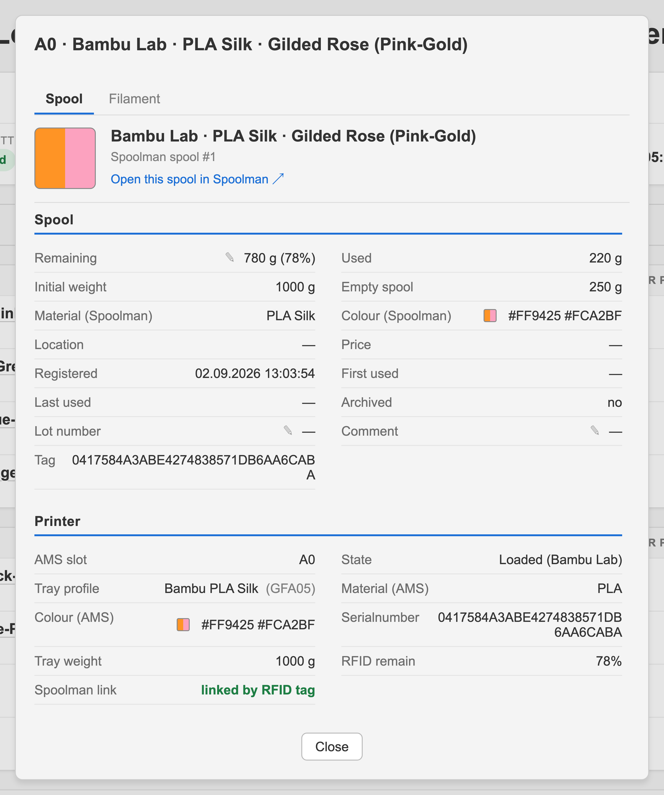
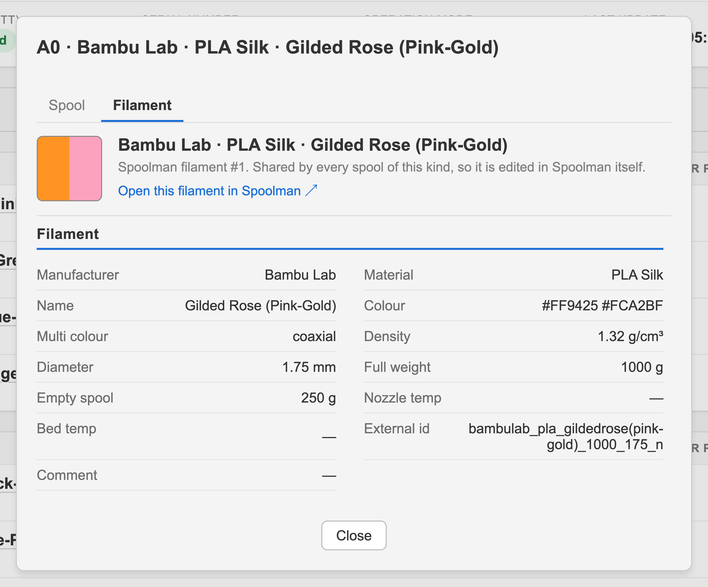

# Web UI

[← Documentation](README.md)

Reachable on `http://<host>:4000`. It asks for a password only if one is set under **Network access**, see [Settings](settings.md).

The dashboard shows the running print, its layer progress, and every loaded spool joined with what the print needs from it: what is on the spool, how much this print takes, and what is left afterwards.

Above each unit's table stands what the unit reports about itself: which unit it is, the relative humidity inside it, its temperature, and, while a drying cycle runs, its target temperature and the minutes left. The name comes from what the unit can do, because nothing in the report states the model: a single slot unit is an **AMS HT**, one with a dryer and a humidity percentage an **AMS 2 Pro**, and everything else stays plain **AMS** — an original AMS and an AMS Lite send byte for byte the same fields, so naming either would be a guess. Which of those appear depends on the hardware. An AMS 2 Pro and an AMS HT report all of it. The original AMS and the AMS Lite report only the five step humidity level, 1 being the driest, and have no temperature sensor. The AMS Lite has no humidity sensor either and always reports 5, so take that level for what it is. The external spool holder reports none of it and gets no header.

Under each spool stands whether its consumption can be booked:

| Marker | Meaning |
| :---- | :---- |
| **tag-linked** | An original Bambu Lab spool, linked through the `tag` extra field. Booked automatically |
| **assigned** | Linked by hand to a Spoolman spool. Booked onto that spool |
| **not tracked** | Nothing links this slot to Spoolman yet. The print runs, but nothing is booked. Use **Assign Spool** |

**Assign Spool** offers both ways of linking a slot the printer cannot identify. Picking a spool that already exists in Spoolman, which opens on the ones that fit the slot, same material and closest colour first, and searches the rest by name, vendor, material or location:

A spool of another material can still be chosen, and says so: the material a slot reports can be wrong, and only you know what is really in there.

Or creating filament and spool right there, filled in from the SpoolmanDB catalogue: manufacturer, then material, then the filament itself. Picking one fills in the colours, the density, the diameter, the temperatures and both weights, none of which a chipless spool reports. A filament that already exists in your Spoolman is used instead of created a second time, and multi colour spools are entered as what they are, one row per colour plus the direction they run in:

Clicking the filament name of a slot opens what Spoolman and the printer each hold about it. Remaining weight, lot number and comment are corrected in place, each behind a pencil in its row. The remaining weight stays read only while something else is about to write it, in legacy mode and while a print is running, and it cannot be set above what the spool can hold:

The second tab carries the filament behind the spool, shared by every spool of its kind and therefore edited in Spoolman itself. Both tabs link to their Spoolman page:

In manual mode the merge and create actions of a Bambu Lab spool work the same way: a button per slot, opening a dialog with what would be written to Spoolman.

The same bar sits on every page and carries two things: where you can go, and your session. Left the three pages with the one you are on marked, right the dark and light mode switch and, once a [password](settings.md#the-web-ui-password) is set, **Log out**. **Logs** lists the server log and one entry per printer, by name, so the log you open is the one you picked rather than the one belonging to whichever printer was selected last. On a phone the three pages fold into one button.

What the page is showing is picked in the page. The dashboard headline names the printer and the log viewer names the log, and that name is the control: click "Loaded Spools on Bambu P2S" in the head of the status card and the printers drop down. With a single printer there is nothing to pick and the name is plain text. The download of a log sits with the log for the same reason, above the box it belongs to.

Logs are read per printer and for the server, across the rotated history, and can be downloaded:

Every page follows the dark mode switch:

